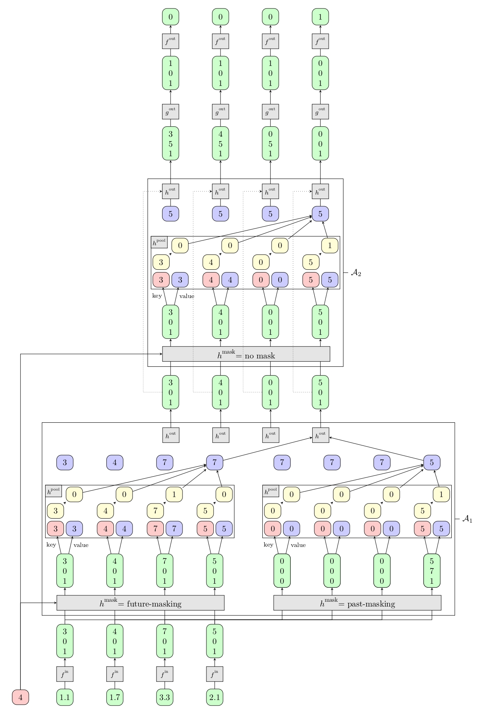

# transformer-verif

A simple LaTeX template based on TikZ for transformer architecture.

*The given illustration shows an Encoder-Only Hard Attention Transformer that selects the second maximum coordinate of a sequence, using different kinds of masks for illustration purposes.*


## Data separated in a CSV file
The TeX files are used to build the architecture of the figure. Data appearing in the different cells are filled from the `data.csv` file.
No modification of the TeX files is needed if only numerical values have to be changed.

/!\ Make sure that the TeX variables in `transformer-sec-max.tex` are consistent with the data in the csv file.

``` 
\def\numnodes{4}
\def\ndim{3}
\def\myposition{4}
```

- `\numnodes` is the number of nodes in each layer
- `\ndim` is the dimension of the column vectors (in green)
- `\myposition` is the considered index in the sequence (in red, at the bottom left of the figure), for which the computation is detailed

You can try changing `\myposition` to 1, 2, or 3. You should see the arrows moving accordingly, but note that data has to be updated in the csv file manually!

If you need other values for `\ndim` or `\numnodes`, make sure that the data given in the csv file has the right dimension.


## Template output:


